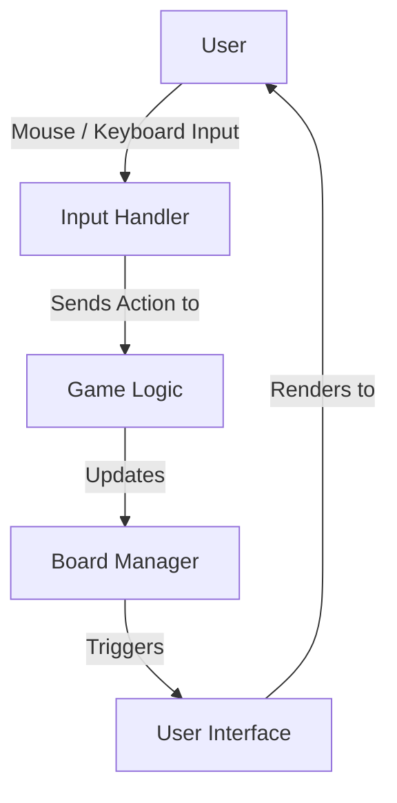
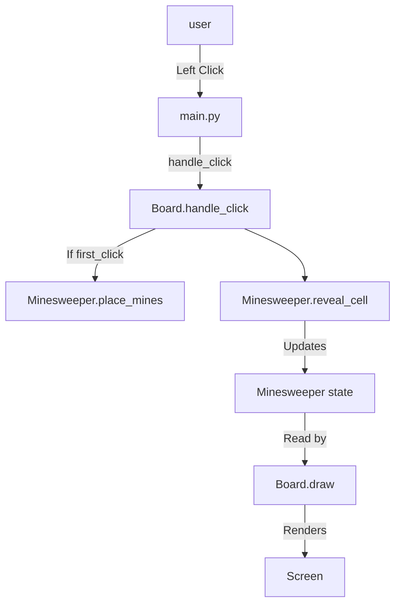
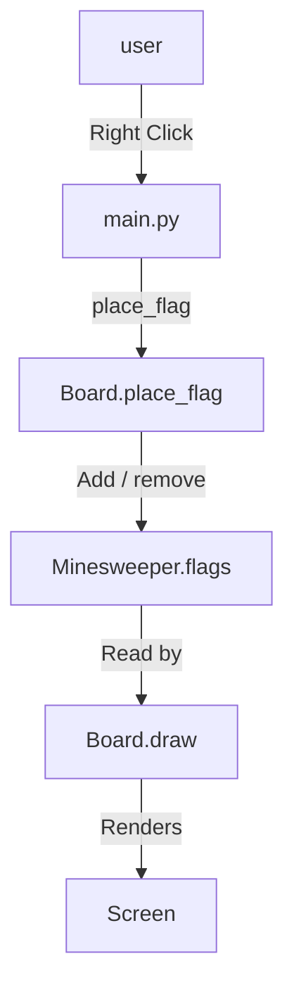

# System Architecture
This document describes the system architecture of Group 17's minesweeper game. It is intended for both the GTA and the Project 2 team.

[Link back to README](../../README.md)

## Overview
This project is a 10x10 version of the puzzle game Minesweeper. It has user specified number of mines (10-20), the first click is guaranteed to be safe, the user can toggle flags, and the game automatically detects a win/loss.

## File Layout
The files are laid out as follows:
```
.
└── minesweeper
    ├── assets
    ├── board.py
    ├── docs
    ├── main.py
    ├── minesweeper.py
    ├── __pycache__
    └── README.md
```

- `assets` folder contains the font and pngs for each cell state.
- `docs` folder contains the system architecture and hours worked documentation.
- `README.md` file is the readme.
- `__pycache__` folder contains files to help python run smoother.

## Components


- Board Manager: Implemented by `Board` and `Minesweeper`
  - `Board` does the geometry and rendering
  - `Minesweeper` does the cell state
- Game Logic: Implemented by `Minesweeper`
- User Interface: Implemented by `Board.draw`, `main.draw_input_screen`, and the status text in the main loop of `main.py`
- Input Handler: Implemented by `main.py` event loop, `Board.handle_click`, and `Board.place_flag`

## Code Structure

The main code files are:

- main.py: depends on `pygame` and `board.py`

- board.py: depends on `pygame` and `minesweeper.py`

- minesweeper.py: depends on `random`

### main.py
- Entry point of the program
  - Initializes Pygame with a 650x650 window
  - Sets the font
- Runs the input screen which gets a valid (10-20) mine count from the user
- Gets mine count from user then creates the board by initializing an instance of the class `Board`
- Then it enters the main loop
- The main loop handles the QUIT and `handle_click` events
  - QUIT event exits the loop
  - `handle_click` events calls either `handle_click()` or `place_flag()` method for left click and right click respectively
- The main loop calls board.draw(screen) each frame and draws the status text
  - Status text is one of the following: `Playing`, `Victory!`, or `Game Over!`
- Outside the loop, `pygame.quit()` is called to exit


### board.py
- Defines the `Board` class
- Methods:
  - `__init__(self, rows, cols, num_mines=10)`
    - Sets the tile size to 50
    - Sets the font
    - Creates an instance of `Minesweeper` named `game`
  - `handle_click(self, mouse_x, mouse_y)`
    - Converts mouse position to tile coordinate (ignoring clicks not on the board)
    - Places mines on the first click using the `Minesweeper` method `place_mines()`
    - Reveals cell clicked using the `Minesweeper` method `reveal_cell()`
  - `place_flag(self, mouse_x, mouse_y)`
    - Converts mouse position to tile coordinate
    - Checks if the cell is revealed, skipping it if it is
    - Toggles the flag on the cell
  - `loadAssets(self)`
    - Loads and resizes numbered tiles and event sprites from the `assets` folder

  - `draw(self, screen)`
    - Draws the column labels A-J
    - Draws the row labels 1-10
    - Draws the sprites depending on the state (ie draws "explosion" sprite if a mine was exploded)
    - Draws the number of adjacent mines
    - Draws the number of remaining flags and mines

### minesweeper.py
- Defines the `Minesweeper` class which is in charge of the core game logic
- Methods:
  - `__init__(self, num_mines, rows, cols)`
    - Creates sets for `self.mines`, `self.revealed`, and `self.flags`
    - Sets `self.first_click` to `True`
    - Sets `self.adjacent_mines` to a a dictionary to track adjacent mines in each cell
    - Sets `self.game_over` and `self.won` to `False`
    - Sets `self.exploded_mine` to `None`
  - `place_mines(self, safe_col, safe_row)`
    - Creates a 3x3 zone centered on the first click
    - Calls `self.calculate_adjacent`
  - `calculate_adjacent(self)`
    - Iterates over all cells
    - Skips calculation if cell is a mine
    - Counts mines in a 3x3 area around the cell and adds result to the `self.adjacent_mines` dictionary
  - `reveal_cell(self, col, row)`
    - Returns `True` if the cell is not a mine, `False` if cell is a mine
    - If cell is a mine: marks the cell in `self.exploded_mine` and sets `self.game_over` to `True`
    - Skips over flagged and already revealed cells
    - If adjacent count is 0, recursively reveals neighbor cells
    - Sets `self.won` to `True` if all safe cells are revealed

## Data Structures
- In class `Minesweeper`:
  - `self.mines`: set of `(col, row)` tuples for mine locations
  - `self.revealed`: set of `(col, row)` tuples for revealed safe cells
  - `self.flags`: set of `(col, row)` tuples for flagged cells
  - `self.adjacent_mines`: dictionary that maps `(col, row)` tuples to an integer (0-8)
  - `self.first_click`, `self.game_over`, `self.won`: booleans
  - `self.exploded_mine`: location of exploded mind `(col, row)` tuple or `None`
- In class `Board`:
  - `self.tiles`: dictionary that maps integers 1-8 to the Pygame tile surfaces (numbers 1-8)
  - `self.events`: dictionary that maps event names to Pygame surfaces (eg a picture of a mine)
    - Event names: `unknown`, `empty`, `flag`, `mine`, `explosion`

## Data Flow
- Input screen:
  1. `main.py` shows the input screen and validates that the user input is an int 10-20
  2. `main.py` creates and instance of `Board` and then enters the main game loop
- Left click:
  1. User left clicks
  2. Pygame generates an event
  3. `main.py` calls `board.handle_click(x, y)`
  4. `Board` converts `(col, row)` and calls `place_mines` if it's the first click
  5. `Board` calls `game.reveal_cell(col, row)` and `Minesweeper` updates its state
  6. `main.py` calls `board.draw(screen)` and `Board` reads `Minesweeper` state and renders
  7. `main.py` draws the status text and calls `pygame.display.flip()`
- Right click:
  1. User right clicks
  2. `main.py` calls `board.place_flag(x, y)`
  3. `Board converts the coordinates and toggles the cell in `Minesweeper.flags`
  4. `Board.draw` renders the updated flag

## Sequence Diagrams

### Left Click / Uncover


### Right Click / Flag

## Asset Attributes

- Numbered Tiles and Sprites
https://uchimama.itch.io/minesweeper-tileset
*Credit: UchiMama via itch.io*

- Pixelated Font
https://tinyworlds.itch.io/free-pixel-font-thaleah
*Credit: Rick Hoppman via itch.io, licensed for commercial use.*

*Disclaimer: All visual assets used in this project marked as free on itch.io. Authors of
the assets are credited above.*

## Person Hours

#### Drew Franke
| Task                                  | Estimated | Actual |
| ------------------------------------- | --------- | ------ |
| Coding and Pygame Documentation       |    1      | 1.5    |
| Coding Task 2 and Left-Click Handling |    1.5    | 1.5    |
| **Total**                             |  **2.5**  | **3**  |
#### Vrishank Kulkarni
| Task            | Estimated | Actual |
| --------------- | --------- | ------ |
| Flagging System (task 5) |     1      | 1.5      |
| **Total**       |      **1**     | **1.5**  |
#### Alex Lanter
| Task                                | Estimated | Actual   |
| ----------------------------------- | --------- | -------- |
| Adjacent Mines and Recursive Reveal |      1     | 1.5      |
| Win/Lose Logic (Merge Integration)                      |      .5     | .75      |
| **Total**                           |      **1.5**     | **2.25** |
#### Mo Osby, Kayaan Patel
| Task           | Estimated | Actual  |
| -------------- | --------- | ------- |
| Win/Lose Logic |     1      | 2      |
| **Total**      |     **1**      | **2** |
#### Davina Love
| Task                   | Estimated | Actual  |
| ---------------------- | --------- | ------- |
| Coding UI              | 2         | 2.0     |
| Asset Files            | .5        | 1.0     |
| Flagging System & misc | 1.0       | 1.5     |
| **Total**              | **3.5**   | **4.5** |
#### Noah Mast
| Task           | Estimated | Actual  |
| -------------- | --------- | ------- |
| Documentation  |     3.5      | 5      |
| **Total**      |     **1**      | **2** |
#### How we got our estimates: 
We convened as a group, and each of us gave our estimates in hours for the tasks we were assigned and those others were assigned. 
We then took the average of hours for each task. 

#### Group Meetings : 4 hours, 4 meetings
#### Group Meeting Estimate : 3 hours, 3 meetings


## Grand Total Person Hours 
### Estimated = 16
### Actual = 22.25
